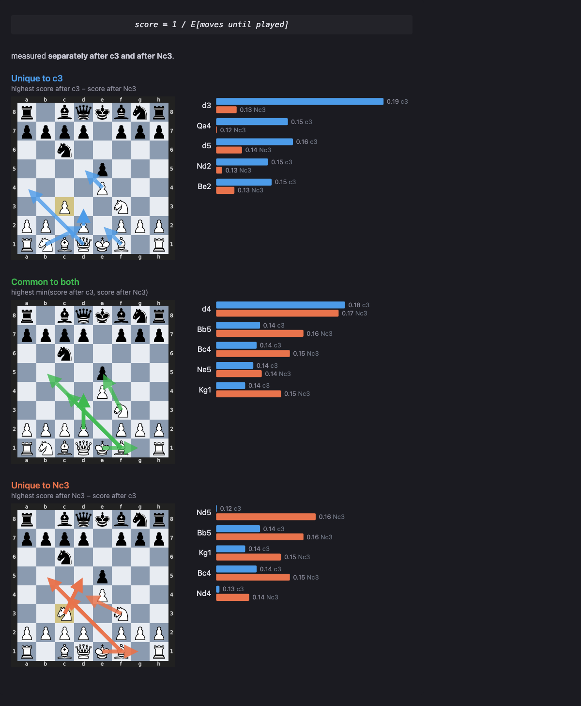

# chess-rollout-analyzer

Compare two candidate chess moves by which downstream moves get played
from the resulting positions.

We pick two moves A and B from the same starting position. Force each one, then let
a policy (e.g. Stockfish) play many rollouts from each. For every downstream move, measure the expected number of moves until that move is played and the proportion of rollouts in which it gets played.

Our two versions of score are:

1. The inverse of this expected number of moves until played, so that higher scores mean "played sooner"
2. The fraction of rollouts in which the move gets played

If a move is never played within an H-move rollout, we use H+1 as the 'moves until played' value for that rollout (standin for infinite).

For example:

| score     | meaning                                                   |
| --------- | --------------------------------------------------------- |
| `1.00`    | played immediately, in every rollout                      |
| `0.50`    | played on the 2nd move, on average                        |
| `1/(M+1)` | never played within the horizon (`0.125` at `horizon=14`) |

Every move is scored twice, once after A and once after B. We then sort all downstream moves in 3 ways:

By score after A − score after B (most unique to A)
By min(score after A, score after B) (most common to both)
By score after B − score after A (most unique to B)

This roughly tells us which moves are most unique to each candidate line, and which are common to both. One could interpret the moves unique to A as the 'intention' or 'plan' behind A.

## Install

```bash
pip install -e .
brew install stockfish        # or: apt install stockfish
```

PNG export shells out to headless Chrome, which macOS usually already has. It is
optional — everything else works without it.

## Example

Starting from the position after e4 e5 Nf3 Nc6 we compare c3 (Ponziani) and Nc3.

```python
from src import SetupBoard, analyze, show_interactive

b = SetupBoard()
b.play("e4", "e5", "Nf3", "Nc6")      # or click pieces on the board

rows, A, B = analyze(b.board, "c3", "Nc3", n=60, horizon=14, depth=8, seed=0)
show_interactive(b.board, rows, A, B)
```



## Layout

```
src/
  engine.py     engine lifecycle + policy (top_moves, softmax_sample, move_token)
  rollout.py    rollout_times — one playout to {move: first own-move ordinal}
  contrast.py   contrast + the pure score_from_ordinals / censor_for helpers
  board.py      SetupBoard — the click-to-move position editor
  viz.py        panels / show / show_interactive, METRICS, to_frame
analysis.ipynb  the front end
tests/          run without a Stockfish binary (stub engine)
```

## Tests

```bash
pytest -q
```

## License

MIT
